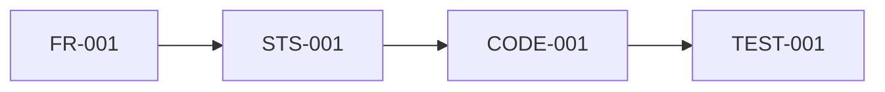
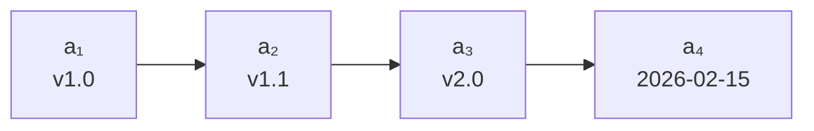
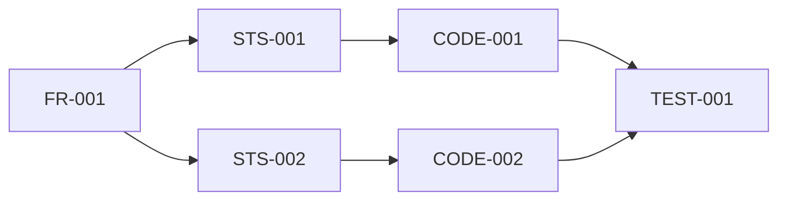
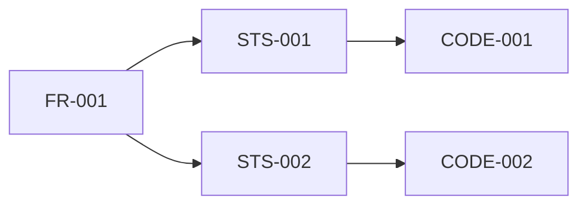
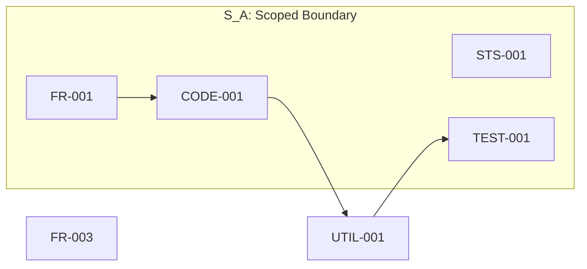
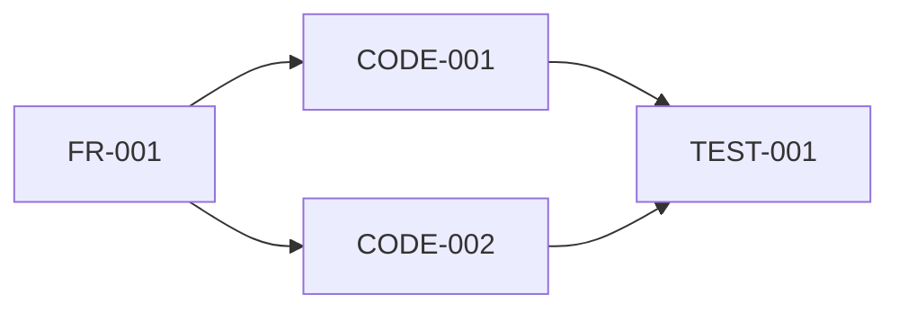
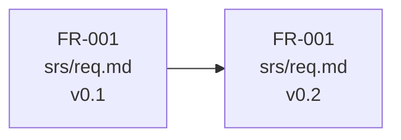
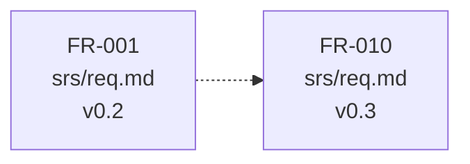
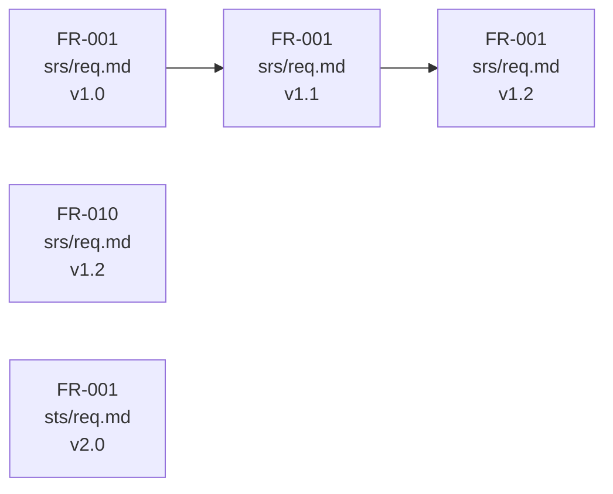

# Anchor Architecture
> A Minimal Structural Foundation for Software Traceability in AI-Assisted Software Development

**Author:** Spark Tsai  
**ORCID:** https://orcid.org/0009-0006-8847-4703  
**Email:** spark.tsai@gmail.com  
**Date:** February 2026  

---

## Abstract

As software development increasingly involves AI-assisted tools and autonomous agents, structural relationships between specifications, code, tests, and governance artifacts degrade into post-hoc reconstruction. 
Existing traceability approaches — provenance models, version control, traceability matrices, and supply chain attestation — address this problem at various levels but share a common assumption: 
that the entities being traced are already structurally identifiable. 
When identifiers, locations, and temporal states are not bound to artifacts at creation time, all subsequent traceability analysis becomes speculative regardless of the sophistication of the tools employed.

This paper presents **Anchor Architecture**, a minimal, model-independent, and pre-analytical framework that defines the structural conditions under which traceability becomes deterministic.
The framework consists of exactly two primitives:
- **Anchor**, a spatiotemporal coordinate $\langle ID, L, \tau \rangle$ that binds identity to a persistent location and temporal index; 
- **Relationship**, a directed binary relation $R \subseteq \mathcal{A} \times \mathcal{A}$ over the anchor set.
From these primitives, three structural views (Linear, Net, Set) and five operations (trace, impact, dependencies, diff, version)
are derived without additional axioms, grounded in relation theory and set theory.

The central claim is that traceability failures are caused not by opaque reasoning or insufficient documentation, but by missing structural anchors. 
The paper formalizes pre-analytical anchoring as a necessary and non-reconstructible condition for structural examinability, and demonstrates through a comprehensive worked example that failure diagnosis, impact analysis, dependency resolution, change detection, and integrity validation each reduce to coordinate operations over the relational structure $(\mathcal{A}, R)$. 
Anchor Architecture is independent of AI models, tooling, and semantic interpretation — it defines the coordinate system upon which provenance, versioning, and governance systems implicitly depend.

---

## Keywords

Anchor Architecture, Structural Traceability, Spatiotemporal Coordinate, Pre-Analytical Anchoring, Relation Theory, Software Engineering, AI-Assisted Development

---

## 1. Introduction

Software artifacts — specifications, code, tests, configurations — are increasingly produced through hybrid authorship involving human developers and AI agents [6][8]. 
Regardless of the author, a recurring structural problem persists: relationships between artifacts are reconstructed after the fact. Provenance models [1] assume entities are already identifiable; version control tracks file-level states but not arbitrary structural entities; traceability matrices [2] collapse under annotation overhead; supply chain frameworks [4][5] presuppose well-defined artifact boundaries. 
None address the foundational question: what minimal structural condition must hold *before* any traceability mechanism can operate?

This paper argues that traceability failures are caused by **missing structural anchors** — not by opaque reasoning, insufficient documentation, or inadequate tooling. 
When identifiers, locations, and temporal states are not bound to artifacts at creation time, all subsequent analysis becomes reconstructive and therefore speculative. 
This condition is non-reconstructible: structure absent at creation cannot be recovered with certainty post-hoc.

To address this, the paper presents **Anchor Architecture**, a minimal, model-independent framework consisting of exactly two primitives: 
- **Anchor**, a spatiotemporal coordinate $\langle ID, L, \tau \rangle$ that binds identity to a persistent location and temporal index; 
- **Relationship**, a directed binary relation $R \subseteq \mathcal{A} \times \mathcal{A}$ over the anchor set. 
From these primitives, 
the framework derives three structural views — Linear, Net, and Set — as predicate-defined subrelations or projections over $(\mathcal{A}, R)$, 
and five operations — trace(), impact(), dependencies(), diff(), and version() — 
as compositions over two base structural capabilities:
relation traversal over $R$ and its transitive closure $R^+$, and content resolution via coordinate. 
Linear View admits a temporal specialization (Timeline View); 
Net View admits a tree-structured degenerate form. 
Set View, parameterized by element type, provides scoping over $\mathcal{A}$ and serves as the return type for operations that produce multiple results.
All views and operations are derived without additional axioms.

The contributions of this paper are:

1. A minimal primitive foundation grounded in relation theory and set theory, requiring exactly two primitives and no additional axioms.
2. Three derived structural views and five composite operations that reduce failure diagnosis, impact analysis, dependency resolution, change detection, and integrity validation to coordinate operations over $(\mathcal{A}, R)$.
3. A formal characterization of pre-analytical anchoring as a necessary condition for structural examinability.

A comprehensive worked example demonstrating these operations over a concrete development scenario is provided in Appendix.

---

## 2. Anchor

An **Anchor** is a spatiotemporal coordinate that binds identity to a persistent location and a temporal state. An anchor does not contain content. It defines where and when content exists.

### 2.1 Definition

#### 2.1 Identifier (ID)

An **Identifier (ID)** establishes a persistent logical reference to a structural entity.

Formally:

$$
ID = f_{id}(Entity)
$$

A **Structural Entity** is independently referenceable:

- Requirement paragraph
- Function
- Test
- Transaction
- Deployment event

Properties:

- Entity Naming
- Location Neutral
- Temporal Neutral
- Structural Necessity

---

#### 2.1.2 Spatial Anchor

A Spatial Anchor binds identity to a persistent location.

$$
A_s = \langle ID, L \rangle
$$

Locator must satisfy **Resolvability**:

$$
resolve(\langle ID, L \rangle) \to Content
$$

---

#### 2.1.3 Spatiotemporal Anchor

A Spatiotemporal Anchor binds identity, location, and time.

$$
\mathcal{A} = \langle ID, L, \tau \rangle
$$

where $\tau$ is a temporal index that establishes when the anchor state was committed.

In practice, $\tau$ is most commonly represented as a **version identifier**
(e.g., `v1.2`, `v2.0`) that corresponds to a specific git commit timestamp.
The version provides human-readable temporal semantics;
the underlying commit timestamp provides strict temporal ordering
across artifacts.

$$
\tau = v1.2 \;\mapsto\; \text{commit } \texttt{a3f7c2d} \;\mapsto\; \text{2026-02-15T10:30:00Z}
$$

The requirement is not a specific format, but **resolvability to a unique temporal position**.
All representations that satisfy this condition are structurally equivalent as $\tau$.

---

### 2.2 Coordinate Structure

Anchoring proceeds as monotonic expansion:

$$
ID \rightarrow \langle ID, L \rangle \rightarrow \langle ID, L, \tau \rangle
$$

Each expansion increases structural determinacy:

| Coordinate                    | Establishes   | Enables                               |
| ----------------------------- | ------------- | ------------------------------------- |
| $ID$                          | Existence     | Identity reference                    |
| $\langle ID, L \rangle$       | Resolvability | Deterministic resolution              |
| $\langle ID, L, \tau \rangle$ | Examinability | Historical query, temporal comparison |

Identity is separated from state.
The same $ID$ at the same $L$ may exist at multiple $\tau$,
and each $\langle ID, L, \tau \rangle$ is a distinct coordinate.

---

### 2.3 Structural Properties

Two anchors are identical if and only if all coordinate components match.

Spatial identity:

$$
\langle ID, L \rangle = \langle ID', L' \rangle \iff ID = ID' \land L = L'
$$

Spatiotemporal identity:

$$
A = A' \iff ID = ID' \land L = L' \land \tau = \tau'
$$

Consequently, the same $ID$ at the same $L$ with different $\tau$ 
yields distinct anchors — this is what makes versioning structurally 
expressible rather than conventionally imposed.

---

### 2.4 Existence and Determinacy

Anchors must be committed at creation time.
If an anchor does not exist prior to analysis, all subsequent analysis becomes speculative.

This condition is non-reconstructible:
multiple histories can produce identical present states.
A temporal index not recorded at creation cannot be uniquely recovered post-hoc.

$$
\neg \exists\, \tau_{\text{created}} \;\Rightarrow\; \neg \exists\, \text{unique reconstruction of } \tau
$$

Pre-analytical anchoring is therefore a necessary condition
for structural examinability — not a best practice,
but a prerequisite.

---

## 3 Relationship

### 3.1 Definition

A **Relationship** is a binary relation over the set of anchors 𝓐:

$$
R \subseteq \mathcal{A} \times \mathcal{A}
$$

An instance of relationship is an ordered pair:

$$
(a_i, a_j) \in R
$$

It expresses **structural adjacency only**.

No embedded semantics are carried at the architectural layer.

Terms such as _implements_, _tests_, _validates_, _depends-on_, or _governs_ are not primitives of the architecture.  
They are interpretations applied externally by domain-specific rules.

The architecture is defined entirely in relational terms.  
No additional structural primitives are required.

---

### 3.2 Validity

A relationship is structurally valid if and only if both participating anchors are resolvable:

$$
(a_i, a_j) \in R_{\text{valid}}
\iff
\operatorname{resolve}(a_i) \neq \varnothing
\land
\operatorname{resolve}(a_j) \neq \varnothing
$$

Validity is therefore determined by coordinate existence, not symbolic declaration.

If

$$
\operatorname{resolve}(a_i) = \varnothing
$$

then no valid relationship involving $a_i$ can exist.

Structural validity is binary.
It is not inferred, repaired, or interpreted.
It is decided by resolvability.

---

### 3.3 Closure and Reachability

Define the transitive closure:

$$
R^{+} = \bigcup_{n=1}^{\infty} R^n
$$

where $R^1 = R$ and $R^{n+1} = \{(a_i, a_k) \mid \exists\, a_j : (a_i, a_j) \in R^n \land (a_j, a_k) \in R\}$.

Traceability is reachability over $R^{+}$.
Impact analysis, dependency chains, and evidence paths
reduce to membership queries in $R^{+}$.

Reachability is determined by declared relations, not temporal ordering.
Given $(a_1, a_2) \in R$, temporal consistency may require:

$$
\tau_1 \le \tau_2
$$

But temporal precedence alone does not generate relation:

$$
\tau_1 < \tau_2 \;\not\Rightarrow\; (a_1, a_2) \in R
$$

Time constrains admissible direction; relation must be declared independently.
If $(a_1, a_2) \in R \land \tau_1 > \tau_2$,
the relation is temporally inconsistent — a structural violation detectable through coordinate comparison, not semantic inspection.

---

### 3.4 Structural Constraints

The relation $R$ is intentionally minimally constrained:

$$
\begin{aligned}
&(a_1, a_2) \in R \land (a_1, a_3) \in R &&\text{is permitted (not a function)} \\
&(a_1, a_2) \in R \nRightarrow (a_2, a_1) \in R &&\text{(not symmetric)} \\
&(a_1, a_2) \in R \land (a_2, a_3) \in R \nRightarrow (a_1, a_3) \in R &&\text{(not transitive)} \\
\end{aligned}
$$

No cardinality, hierarchy, acyclicity, or reflexivity constraints are imposed.

**Semantic neutrality.**
Relationship types such as *implements*, *tests*, *governs*, or *constrains*
are not architectural primitives.
They are application-layer interpretations imposed over structural adjacency.
The relation is invariant; meaning is delegated.

**Temporal independence.**
Temporal precedence does not generate relation:

$$
\tau(a_i) < \tau(a_j) \;\not\Rightarrow\; (a_i, a_j) \in R
$$

Relation must be declared independently.
Application-layer policies may optionally impose
$\tau(a_i) \le \tau(a_j)$ to enforce causal or lifecycle consistency,
but such constraints are governance-layer rules, not structural necessities.

---

## 4. Structural Views

The global relation $R \subseteq A \times A$ captures all declared relationships among anchors. 
In practice, however, reasoning over the full relation is rarely useful. 
Most structural reasoning targets a restricted subset of $R$ that satisfies specific constraints — 
a particular dependency chain, a shared scope, or a temporal ordering.

Structural views formalize this restriction. A structural view is a subrelation of $R$ derived by applying a predicate over its elements.
Views introduce no new primitives. They operate over the same anchor set $A$ and relation set $R$, selecting and exposing particular structural patterns already present in the global relation.

Among these, **Linear View**, **Net View**, **Set View**, and **Timeline View** are the most commonly occurring forms. 
They are not exhaustive — other forms may arise under different predicates — but they cover the structural patterns most relevant to governance reasoning.

### 4.1 Formal Definition

A structural view is defined by a predicate $C$ over pairs in $R$:

$$
R_{view} = \{ (a_i, a_j) \in R \mid C(a_i, a_j) \}
$$

Thus:

$$
R_{view} \subseteq R
$$

Each named view corresponds to a distinct **predicate** applied to the same underlying relation:

$$
R_{linear} = \{ (a_i, a_j) \in R \mid C_{linear}(a_i, a_j) \}
$$

$$
R_{net} = \{ (a_i, a_j) \in R \mid C_{net}(a_i, a_j) \}
$$

$$
R_{set} = \{ (a_i, a_j) \in R \mid C_{set}(a_i, a_j) \}
$$

$$
R_{timeline} = \{ (a_i, a_j) \in R \mid C_{timeline}(a_i, a_j) \}
$$

Accordingly:

$$
R_{linear},\; R_{net},\; R_{set},\; R_{timeline} \subseteq R
$$

These views are predicate-defined subrelations, not distinct primitive types. 
They characterize recurring geometric patterns — sequential chains, networked dependencies, unordered collections, temporally ordered sequences — that emerge from specific selection conditions over $R$.

They should be understood as common structural forms, not as a closed taxonomy of all possible views.

### 4.2 Linear View

A Linear View is a totally ordered path through $R$, representing sequential structural progression from
one anchor to the next without branching or merging.

#### Formal Definition

A linear chain is a sequence of anchors:

$$
L = [a_1, a_2, \dots, a_n]
$$

such that:

$$
(a_i, a_{i+1}) \in R \quad \text{for all } i \in [1, n-1]
$$

and each anchor appears at most once:

$$
a_i \neq a_j \quad \text{for all } i \neq j
$$

#### Example

Consider four anchors spanning requirement, design, implementation, and test execution:


The relation set:

$$
R_{example} = \{ (\text{FR-001}, \text{STS-001}),\; (\text{STS-001}, \text{CODE-001}),\; (\text{CODE-001}, \text{TEST-001}) \}
$$

yields the linear chain:

$$
L = [\text{FR-001},\; \text{STS-001},\; \text{CODE-001},\; \text{TEST-001}]
$$

a complete traceability path from requirement specification
to test evidence.

#### Properties

- **No branching:** Each anchor has at most one successor in the view
- **No merging:** Each anchor has at most one predecessor in the view
- **Heterogeneous temporal index:** Version identifiers and timestamps may coexist within the same chain

The absence of branching and merging distinguishes Linear View from Net View. If either property is violated, the structure is no longer linear.

#### Application

Linear View is the natural form for cross-domain traceability.
A single chain may span requirement specifications, design documents, implementation code, and test evidence — each with its own temporal semantics — without requiring schema alignment.

Typical applications include:

- **Requirement tracing:** specification → design → implementation → verification
- **Audit chains:** decision → approval → execution → evidence
- **Incident tracking:** detection → diagnosis → remediation → confirmation

#### Specialization: Timeline View

When the linear chain is ordered strictly by temporal index:

$$
\tau(a_1) < \tau(a_2) < \dots < \tau(a_n)
$$

where $\tau(a)$ denotes the temporal index of anchor $a$, the Linear View specializes into a Timeline View —
a temporally ordered trace through $R$.


A Timeline View inherits all Linear View properties.
The additional constraint is that progression follows temporal succession rather than arbitrary structural ordering.

Note that not all Linear Views are Timeline Views.
A linear chain may follow a structural path where temporal indices are not monotonically increasing — for example, when a newer requirement traces to an older implementation. 
The structural relation remains valid; only the temporal specialization does not hold.

Temporal ordering over a set of anchors without requiring adjacency in $R$ is not a Timeline View, but a sort operation applied to a Set View $S_A$.

---

### 4.3 Net View

A Net View is the most general structural view, permitting arbitrary branching, merging, and many-to-many relationships among anchors. 
Where Linear View enforces strict sequential progression, Net View imposes no topological constraint beyond membership in $R$.

#### Formal Definition

A Net View over a predicate $C_{net}$ is:

$$
R_{net} = \{ (a_i, a_j) \in R \mid C_{net}(a_i, a_j) \}
$$

In the limiting case where $C_{net}$ is universally true:

$$
R_{net} = R
$$

Net View permits:

- Arbitrary out-degree: an anchor may relate to multiple successors (branching)
- Arbitrary in-degree: an anchor may be reached from multiple predecessors (merging)

#### Example

Consider a requirement that decomposes into two design strategies, each implemented separately, with both converging at a shared test execution:


The relation set:

$$
R_{net} = \left\{
\begin{aligned}
  &(\text{FR-001}, \text{STS-001}), \\
  &(\text{FR-001}, \text{STS-002}), \\
  &(\text{STS-001}, \text{CODE-001}), \\
  &(\text{STS-002}, \text{CODE-002}), \\
  &(\text{CODE-001}, \text{TEST-001}), \\
  &(\text{CODE-002}, \text{TEST-001})
\end{aligned}
\right\}
$$

This structure exhibits branching at FR-001 (one requirement, two design strategies) and merging at TEST-001 (two implementations, one test evidence). Neither property is expressible as a Linear View.

#### Properties

- **Arbitrary branching:** An anchor may relate to multiple successors
- **Arbitrary merging:** An anchor may be reached from multiple predecessors
- **No cardinality restriction:** In-degree and out-degree are unbounded

The absence of branching and merging distinguishes Linear View from Net View.
If either property is violated, the structure is no longer linear.

#### Application

Net View is the natural form for dependency and impact analysis, where structural relationships are inherently many-to-many.

Typical applications include:

- **Impact analysis:** a single requirement change propagates through branching design and implementation paths
- **Dependency resolution:** shared utilities (merging) create coupling across otherwise independent chains
- **Governance detection:** unexpected merging or cycles may signal structural anomalies such as undeclared coupling or circular dependencies

#### Specialization: Tree View

When a Net View contains branching but no merging — that is, every anchor has at most one predecessor — the structure degenerates into a tree.

Formally, a tree is a Net View satisfying:

$$
\forall\, a_j \in A:\; |\{ a_i \mid (a_i, a_j) \in R_{net} \}| \leq 1
$$


Here FR-001 branches into two strategies, each leading to a distinct implementation. 
No merging occurs — CODE-001 and CODE-002 have exactly one predecessor each. 
This is a valid tree.

Adding the relation $(\text{CODE-002}, \text{TEST-001})$ alongside $(\text{CODE-001}, \text{TEST-001})$ violates the single-predecessor constraint, and the structure is no longer a tree but a general net.

The containment hierarchy is therefore:

$$
\text{Linear View} \subset \text{Tree} \subset \text{Net View}
$$

---

### 4.4 Set View

A Set View is an unordered collection of structural elements.
Unlike Linear View and Net View, which derive subrelations of $R$, Set View defines membership over a specified element type without implying ordering or structural relationship among its elements.

#### Formal Definition

A Set View is parameterized by its element type $T$:

$$
S_T = \{ e \in T \mid C_{set}(e) \}
$$

where $T$ may be any structural type defined in this architecture.

Common instantiations include:

| Notation | Element Type | Interpretation                         |
| -------- | ------------ | -------------------------------------- |
| $S_A$    | Anchor       | A boundary or scope over anchors       |
| $S_L$    | Linear View  | A collection of possible paths         |
| $S_R$    | Relation     | A filtered set of structural relations |

In the case of $S_A$, membership is independent of $R$:

$$
a_i \in S_A \land a_j \in S_A \nRightarrow (a_i, a_j) \in R
$$

Set View does not modify or augment $R$.
It provides a membership-based scoping mechanism over which subsequent queries may be constrained.

#### Example

**$S_A$: Anchor boundary**

Consider six anchors where a subset defines a scoped boundary:


$$
S_A = \{ \text{FR-001},\; \text{STS-001},\; \text{CODE-001},\; \text{TEST-001} \}
$$

UTIL-001 and FR-003 exist in $A$ and participate in $R$, but fall outside the defined boundary.
The relation $(\text{CODE-001}, \text{UTIL-001}) \in R$ crosses the boundary. 
Set View does not alter this relation; the boundary defines membership, not connectivity.

**$S_L$: Path collection**

Consider all possible paths originating from FR-001 in the following structure:


$$
S_L = \{
  [\text{FR-001},\; \text{STS-001},\; \text{CODE-001}],\;
  [\text{FR-001},\; \text{STS-002},\; \text{CODE-002}]
\}
$$

Each element of $S_L$ is a Linear View. The set itself carries no ordering among its elements — 
the two paths are members, not a sequence.

This is the return type of $trace(\text{FR-001})$:
a Set View parameterized by Linear View.

#### Properties

- **Parameterized:** Element type $T$ is not fixed; it may be Anchor, Linear View, Relation, or other structural types
- **No structural implication:** Membership does not entail adjacency, causality, or ordering among elements
- **No modification of $R$:** The set is defined independently from the global relation
- **Composable:** Set operations (union, intersection, difference) apply regardless of element type

Set View is the only structural view that does not derive a subrelation of $R$. 
When parameterized by Anchor, it provides a scoping mechanism. When parameterized by other structural types, it serves as the natural return type for operations that produce multiple results.

#### Application

Typical applications vary by element type:

$S_A$ applications:

- **Compliance auditing:** verify that all anchors within a defined boundary satisfy required constraints
- **Scoped impact analysis:** compute $impact(a) \cap S_A$ to restrict propagation to a defined boundary
- **Governance boundary verification:** detect whether modifications have introduced anchors outside an approved set

$S_L$ applications:

- **Path enumeration:** $trace(a)$ returns $S_L$ containing all reachable linear chains from a given anchor
- **Redundancy analysis:** multiple paths to the same target may indicate structural redundancy or desired fault tolerance
- **Coverage verification:** confirm that all required traceability paths exist within $S_L$

---

## 5. Structural Operations

Structural operations are queries over the relation and coordinate space. They introduce no new primitives.
All operations derive exclusively from:

- Anchor set $\mathcal{A}$
- Relation $R \subseteq \mathcal{A} \times \mathcal{A}$

**Transitive Closure**

Let $R^+$ denote the transitive closure of $R$:

$$
R^+ = \bigcup_{n=1}^{\infty} R^n
$$

where:

$$
R^1 = R
$$

$$
R^{n+1} = R^n \circ R = \{ (a, c) \mid \exists\, b: (a, b) \in R^n \land (b, c) \in R \}
$$

$(a_i, a_j) \in R^+$ if and only if there exists
a directed path from $a_i$ to $a_j$.

**Operation Classes**

All structural analysis reduces to three classes:

- **Traversal** over $R$ or $R^+$
- **Projection** over $\mathcal{A}$
- **Content resolution** via coordinate

No semantic inference is required at this layer.

---

### 5.1 Base Structural Operations

The architecture defines two structural primitives:
Anchor (coordinate) and Relationship (binary relation).
At the operational layer, two base capabilities emerge from these primitives:

- Relation Traversal
- Content Resolution

All higher-level operations compose these two capabilities.

#### 5.1.1 Relation Traversal

Traversal computes structural reachability from an anchor.

Given anchor $a$, the image set under $R^+$ is:

$$
image_{R^+}(a) = \{ b \in \mathcal{A} \mid (a, b) \in R^+ \}
$$

This expresses structural propagation without semantic interpretation.

Traversal does not assume hierarchy, tree structure, unique parent, or semantic meaning.
It is pure relational expansion.

#### 5.1.2 Content Resolution

Resolution retrieves content from a spatiotemporal coordinate.

Given:

$$
a = \langle ID, L, \tau \rangle
$$

$$
resolve(a) \rightarrow Content
$$

where $Content$ represents the artifact state at the specified coordinate. This may be text, binary data, or metadata — 
the architecture does not constrain content type.

**Determinism.** Resolution is deterministic: same coordinate yields same content.
Different $\tau$ at same $(ID, L)$ yields different content.

**Failure.** If $resolve(a) = \varnothing$, structural examinability at that coordinate cannot be guaranteed. 
Resolution failure does not invalidate the anchor definition, but prevents structural verification at that coordinate.

This may occur when:

- Artifact was deleted
- Version control history is incomplete
- Temporal index references non-existent state

---

### 5.2 Composite Operations

Composite operations are named projections over the base
structural capabilities. They compose existing elements:

- Anchor membership over $\mathcal{A}$
- Relation traversal over $R$
- Reachability over $R^+$
- Coordinate resolution via $resolve()$

They do not extend the architecture or introduce new primitives.

The operations defined below represent common application patterns.
They are not exhaustive. Any operation reducible to selection
over $\mathcal{A}$, traversal over $R$ or $R^+$, or coordinate
comparison is admissible within the architecture.
The architecture defines structural capabilities,
not a closed set of named operations.

| Operation        | Input         | Operates On   | Structural Basis     | Return                            | Core Question                           |
| ---------------- | ------------- | ------------- | -------------------- | --------------------------------- | --------------------------------------- |
| $trace()$        | $a$, $P$      | $R^+$         | Path enumeration     | $S_L$                             | Through what chain does this propagate? |
| $impact()$       | $a$           | $R^+$         | Reachability set     | $S_\mathcal{A}$                   | What is downstream?                     |
| $dependencies()$ | $a$           | $R^+$         | Reverse reachability | $S_\mathcal{A}$                   | What is upstream?                       |
| $diff()$         | $a_1$, $a_2$  | $\mathcal{A}$ | Content resolution   | $\Delta$                          | What changed between two states?        |
| $version()$      | $ID^*$, $L^*$ | $\mathcal{A}$ | Identity + Location  | $S_\mathcal{A}$ or $L_{timeline}$ | What is the temporal sequence?          |

---

#### 5.2.1 trace()

Trace is goal-oriented path traversal with structural preservation.
Given a source anchor and a target condition, it discovers all directed paths through $R$ that connect them, returning complete ordered sequences — not just endpoints.

##### Signature

$$
trace(a, P) \rightarrow S_L
$$

When $P$ matches a single specific anchor $a_{end}$:

$$
trace(a_{start}, a_{end}) \rightarrow S_L
$$

is shorthand for $trace(a_{start},\; P(x) := x = a_{end})$.

##### Formal Definition

$$
trace(a, P) = \{ [a_0, a_1, \dots, a_n] \mid a_0 = a \land P(a_n) \land \forall\, i: (a_i, a_{i+1}) \in R \}
$$

Each element of the result is an ordered sequence of anchors forming a directed path in $R$.
If no reachable anchor satisfies $P$, the result is $\emptyset$.

##### Example

Consider a requirement with two implementation paths converging at a shared test anchor:



Define target predicate:

$$
P_{test}(x) := x = \text{TEST-001}
$$

Then:

$$
trace(\text{FR-001},\; P_{test}) = \left\{
\begin{aligned}
  &[\text{FR-001},\; \text{CODE-001},\; \text{TEST-001}], \\
  &[\text{FR-001},\; \text{CODE-002},\; \text{TEST-001}]
\end{aligned}
\right\}
$$

Two distinct structural paths exist from requirement to test.
Trace reconstructs the structural chains, not the semantic meaning of the relations.

##### Properties

- **Goal-oriented:** Requires a termination predicate $P$; traversal without target is not a trace
- **Path-preserving:** Returns complete ordered sequences, not reachable sets
- **Multi-valued:** Multiple paths may satisfy the same predicate, all are returned
- **Empty on unreachability:** If no path from $a$ reaches an anchor satisfying $P$, result is $\emptyset$

Trace answers: through what structural chains
does $a$ reach a target satisfying $P$?

##### Application

Typical applications include:

- **Requirement verification:** trace from specification to test evidence, confirming all implementation paths are covered
- **Failure diagnosis:** when a test fails, trace reveals which structural paths may be responsible
- **Completeness analysis:** compare $trace(a, P)$ against expected paths to detect missing chains
- **Structural redundancy:** multiple paths to the same target may indicate redundancy or desired fault tolerance

---

#### 5.2.2 impact()

Impact computes the set of all anchors structurally downstream
from a given anchor. It is a reachability projection over $R^+$ —
returning which anchors are affected, without preserving
the paths through which the effect propagates.

##### Signature

$$
impact(a) \rightarrow S_\mathcal{A}
$$

When combined with a Set View boundary:

$$
impact(a) \cap S_{boundary} \rightarrow S_\mathcal{A}
$$

restricts the result to anchors within a defined scope.

##### Formal Definition

$$
impact(a) = \{ b \in \mathcal{A} \mid (a, b) \in R^+ \}
$$

If no anchor is reachable from $a$, the result is $\emptyset$.

##### Example

Consider a requirement with two implementation paths
converging at a shared test anchor:


$$
impact(\text{FR-001}) = \{ \text{CODE-001},\; \text{CODE-002},\; \text{TEST-001} \}
$$

Three anchors are structurally downstream from FR-001.
Impact reveals the affected set without indicating
through which paths the effect reaches them.

With a scoped boundary
$S_{boundary} = \{ \text{FR-001},\; \text{CODE-001},\; \text{TEST-001} \}$:

$$
impact(\text{FR-001}) \cap S_{boundary} = \{ \text{CODE-001},\; \text{TEST-001} \}
$$

CODE-002 is excluded — it falls outside the defined boundary.

##### Properties

- **Set-valued:** Returns an unordered set of anchors, not paths
- **Path-agnostic:** Reachability is computed but traversal structure is discarded
- **Transitive:** Operates over $R^+$, not just direct relations in $R$
- **Composable:** $impact(a) \cap S$ restricts analysis to a governance boundary

Impact answers: if anchor $a$ changes,
which anchors are structurally downstream?

##### Application

Typical applications include:

- **Change impact estimation:** determine the blast radius before modifying a requirement or implementation
- **Governance scoping:** combine with Set View to restrict impact analysis within defined boundaries
- **Risk assessment:** anchors with large $|impact(a)|$ represent high-coupling structural nodes
- **Regression targeting:** identify which test anchors fall within $impact(a)$ to determine minimum re-verification scope


#### 5.2.3 dependencies()

Dependencies computes the set of all anchors structurally upstream
from a given anchor. It is the reverse of $impact()$ —
returning what $a$ depends on, rather than what $a$ affects.

##### Signature

$$
dependencies(a) \rightarrow S_\mathcal{A}
$$

When combined with a Set View boundary:

$$
dependencies(a) \cap S_{boundary} \rightarrow S_\mathcal{A}
$$

restricts the result to anchors within a defined scope.

##### Formal Definition

$$
dependencies(a) = \{ b \in \mathcal{A} \mid (b, a) \in R^+ \}
$$

If no anchor reaches $a$, the result is $\emptyset$.

##### Example

Consider the same structure from $impact()$:


$$
dependencies(\text{TEST-001}) = \{ \text{CODE-001},\; \text{CODE-002},\; \text{FR-001} \}
$$

Three anchors are structurally upstream from TEST-001.
Dependencies reveals what TEST-001 relies on,
without indicating the paths through which reliance flows.

##### Properties

- **Set-valued:** Returns an unordered set of anchors, not paths
- **Path-agnostic:** Reverse reachability is computed but traversal structure is discarded
- **Transitive:** Operates over $R^+$, not just direct relations in $R$
- **Symmetric to impact:** $b \in impact(a) \iff a \in dependencies(b)$

Dependencies answers: what anchors must be stable
for anchor $a$ to remain structurally valid?

##### Application

Typical applications include:

- **Stability analysis:** determine which upstream anchors must remain unchanged for $a$ to be valid
- **Build ordering:** identify prerequisite anchors that must be resolved before $a$
- **Root cause investigation:** when $a$ exhibits anomalies, $dependencies(a)$ identifies candidate sources
- **Coupling assessment:** anchors with large $|dependencies(a)|$ represent high-dependency structural nodes


#### 5.2.4 diff()

Diff computes structural or content differences between
two anchors by comparing their resolved states.
It operates over the coordinate space $\langle ID, L, \tau \rangle$,
with comparison semantics determined by which coordinate
components differ between the two inputs.

##### Signature

$$
diff(a_1, a_2) \rightarrow \Delta
$$

where $\Delta = resolve(a_1) \ominus resolve(a_2)$.

$\Delta$ is not a structural view. It is a content-level
comparison result whose structure depends on the artifact type.

##### Formal Definition

Given two anchors:

$$
a_1 = \langle ID_1, L_1, \tau_1 \rangle, \quad
a_2 = \langle ID_2, L_2, \tau_2 \rangle
$$

$$
diff(a_1, a_2) = resolve(a_1) \ominus resolve(a_2)
$$

The comparison mode is determined by coordinate divergence:

| Mode                    | Condition                                        | Interpretation                                   |
| ----------------------- | ------------------------------------------------ | ------------------------------------------------ |
| Version evolution       | $ID_1 = ID_2,\; L_1 = L_2,\; \tau_1 \neq \tau_2$ | Same artifact at different points in time        |
| Location divergence     | $ID_1 = ID_2,\; L_1 \neq L_2$                    | Same concept materialized at different locations |
| Cross-anchor comparison | $ID_1 \neq ID_2$                                 | Structural comparison between distinct anchors   |

These modes are not declared by the caller.
They are determined by the coordinate relationship
between $a_1$ and $a_2$.

##### Example

**Version evolution:**


$$
diff(\text{FR-001}_{v0.1},\; \text{FR-001}_{v0.2}) \rightarrow \Delta_{version}
$$

Same anchor, same location, different temporal index.
Reveals how a requirement evolved between versions.

**Cross-anchor comparison:**


$$
diff(\text{FR-001}_{v0.2},\; \text{FR-010}_{v0.3}) \rightarrow \Delta_{cross}
$$

Different anchors at the same location.
Reveals structural divergence — whether FR-010 inherited,
extended, or replaced content from FR-001.

##### Properties

- **Coordinate-driven:** Comparison mode is determined by coordinate divergence, not by caller declaration
- **Resolution-dependent:** Requires $resolve(a_1)$ and $resolve(a_2)$ to succeed; if either fails, diff is undefined
- **Symmetric:** $diff(a_1, a_2)$ and $diff(a_2, a_1)$ yield inverse deltas
- **Type-sensitive:** The differencing operator $\ominus$ depends on content type

Diff answers: what changed between two structural coordinates?

##### Application

Typical applications include:

- **Version auditing:** detect what changed between successive versions of the same anchor
- **Requirement lineage:** compare across anchors to determine inheritance, divergence, or replacement
- **Drift detection:** identify unintended divergence between anchors that share the same location
- **Governance verification:** confirm that changes between coordinates fall within approved modification scope


#### 5.2.5 version()

Version projects all anchors sharing the same identity and location
across their temporal indices. It operates over the coordinate space
directly — no traversal of $R$ is required.

##### Signature

$$
version(ID^*, L^*) \rightarrow S_\mathcal{A}
$$

When temporal comparability is available, the result
may be represented as an ordered sequence:

$$
version(ID^*, L^*) \rightarrow L_{timeline}
$$

##### Formal Definition

$$
version(ID^*, L^*) = \{ a \in \mathcal{A} \mid ID_a = ID^* \land L_a = L^* \}
$$

When temporal ordering is available within the result set:

$$
\tau_1 < \tau_2 < \dots < \tau_n
$$

the projection may be expressed as:

$$
version(ID^*, L^*) = [
  \langle ID^*, L^*, \tau_1 \rangle,\;
  \langle ID^*, L^*, \tau_2 \rangle,\;
  \dots,\;
  \langle ID^*, L^*, \tau_n \rangle
]
$$

Ordering semantics are delegated to the underlying
version-control or temporal indexing system.

##### Example

Consider five anchors, three of which share the same
identity and location:


$$
version(\text{FR-001},\; \text{srs/req.md}) = [
  \langle \text{FR-001},\; \text{srs/req.md},\; v1.0 \rangle,\;
  \langle \text{FR-001},\; \text{srs/req.md},\; v1.1 \rangle,\;
  \langle \text{FR-001},\; \text{srs/req.md},\; v1.2 \rangle
]
$$

FR-010 is excluded — different identity.
FR-001 at sts/req.md is excluded — different location.

##### Properties

- **Coordinate-driven:** Selection is based on identity and location, not on $R$
- **Relation-independent:** Does not require or consult structural relations
- **Conditionally ordered:** Returns a set when temporal comparability is unavailable; a timeline when it is

Version answers: what states of this anchor exist
at this location across time?

##### Application

Typical applications include:

- **Change history:** track the evolution of a specific anchor at a fixed location
- **Temporal navigation:** select a specific version for targeted analysis
- **Diff preparation:** identify anchor pairs for $diff()$ comparison
- **Rollback analysis:** locate previous states when current state is under investigation

---

### 5.3 Structural Summary

All structural analysis reduces to two base capabilities:

- **Relation traversal** over $R$ and $R^+$
- **Content resolution** via coordinate

#### Operational Characteristics

**$trace()$, $impact()$, and $dependencies()$**

All three traverse $R^+$.
$trace()$ preserves paths; $impact()$ and $dependencies()$
discard path structure and return anchor sets.
$impact()$ and $dependencies()$ are symmetric:

$$
b \in impact(a) \iff a \in dependencies(b)
$$

Together they provide three complementary views
of structural propagation: path, downstream, and upstream.

**$diff()$ and $version()$**

Both operate on resolved content via coordinates.
$version()$ organizes anchors by temporal index;
$diff()$ compares content between two coordinates.
They compose sequentially:

$$
\text{Let } [a_1, \dots, a_n] = version(ID^*, L^*)
$$

$$
diff(a_{n-1}, a_n)
$$

#### Architectural Properties

Operations do not introduce semantics.
They operate on coordinates and relations.
No operation assumes semantic labels, hierarchical structure,
or domain knowledge. All operations are domain-agnostic,
tool-independent, and model-independent.

Meaning emerges only at the application layer.

#### Composability

Operations compose to answer complex queries:

*Which test anchors are affected by a requirement change?*

$$
impact(a_{req}) \cap \{ a \in \mathcal{A} \mid ID_a \in \text{TEST-*} \}
$$

*What are the upstream dependencies of a specific test?*

$$
dependencies(a_{test})
$$

*Trace how a specific version reached a target anchor:*

$$
trace(a_v,\; P(x) := x = a_{target})
$$

All composed from the same two base capabilities.

#### Invariance Principle

The relational substrate $(\mathcal{A}, R)$ is invariant.
Operations provide lenses, not transformations.

Traceability is not documentation. It is coordinate geometry.

---

## 6. Related Work

Anchor Architecture positions itself as a **minimal structural foundation** for traceability, distinct from existing provenance, attestation, and traceability approaches. We categorize related work into four clusters and highlight key differences.

### 6.1 Provenance Models (Activity-Centric)

The W3C PROV-DM framework formalizes provenance through entities, activities, and agents connected by derivation relations. It excels at recording "what happened" after execution.

**Key Difference**  

PROV-DM is post-hoc and activity-centric — it assumes entities are already identifiable and focuses on causal history. Anchor Architecture operates at a more fundamental layer: defining pre-analytical coordinates (ID, L, τ) before any provenance relation can be meaningfully asserted. Without such coordinates, PROV-DM's entities remain ambiguous in AI-generated artifacts.

---

### 6.2 Version Control and Artifact Tracking

Version control systems (Git, Mercurial) track file states through commits and diffs, while tools like DVC extend this to data artifacts.

**Key Difference**  

These systems track temporal changes at the file level but do not generalize to arbitrary structural entities or enforce pre-analytical binding. Anchor Architecture abstracts beyond files: any entity (requirement, function, test, log) receives a spatiotemporal coordinate, enabling cross-artifact traceability without file-centric assumptions.

---

### 6.3 Manual Traceability Matrices and Tools

Classical requirements traceability (e.g., traceability matrices in DOORS, Polarion, Jama) links requirements to design, code, and tests through manual annotations or tooling conventions.

**Key Difference**  

These approaches collapse under scale due to annotation overhead and implicit assumptions about artifact identity. Anchor Architecture eliminates the annotation tax: traceability emerges implicitly from structural relations over pre-bound coordinates, not from manual links.

---

### 6.4 Supply Chain Attestation and Build Provenance

Frameworks like SLSA and in-toto focus on build integrity, artifact provenance, and secure pipelines through attestations and cryptographic hashes.

**Key Difference**  

SLSA/in-toto assume well-defined build steps and artifact boundaries. Anchor Architecture generalizes beyond builds: it defines structural examinability for any artifact type (spec, code, log, governance) through coordinate binding, independent of pipeline or security objectives.

---

### 6.5 AI-Generated Code Traceability and Agentic SE

Recent work on LLM-based agents in software engineering (e.g., surveys on agent drift, behavioral degradation, and code generation) highlights traceability collapse, ghost intent, and inference creep in AI-assisted workflows.

**Key Difference**  

Most approaches rely on model transparency, prompt engineering, or runtime guardrails. Anchor Architecture is model-independent: it enforces pre-analytical coordinates as a structural prerequisite, mitigating hallucination and drift through geometric validity rather than probabilistic filtering.

### 6.6 Positioning Summary

Anchor Architecture differs from existing work in three fundamental ways:

1. **Pre-analytical vs. post-hoc** — It defines coordinates before analysis, not after execution.
2. **Minimal relational core** — Two primitives (Anchor, Relation) suffice; all views and operations are projections.
3. **Semantic neutrality** — No embedded meaning; interpretation is delegated to application layer.

This relational foundation fills a gap in AI-assisted SE: traceability as a deterministic coordinate geometry, rather than heuristic or model-dependent reconstruction.

---

## 7. Conclusion

### 7.1 Summary

This paper presented Anchor Architecture, a minimal structural foundation for software traceability. The framework reduces traceability to two primitives — Anchor as a spatiotemporal coordinate $\langle ID, L, \tau \rangle$ and Relationship as a directed binary relation $R \subseteq \mathcal{A} \times \mathcal{A}$ — from which four structural views (Linear, Net, Set, Timeline) and four operations (trace, impact, diff, version) are derived without additional axioms. The framework is model-independent, tool-independent, semantically neutral, and pre-analytical: it defines the structural conditions under which traceability becomes deterministic, regardless of whether artifacts are produced by human developers or AI systems.

The central claim — that traceability failures are caused by missing structural anchors, not by opaque reasoning — was substantiated through formal analysis and a comprehensive worked example (Section 8). Failure diagnosis, impact analysis, change detection, and history reconstruction were each reduced to coordinate operations over the relational structure $(\mathcal{A}, R)$. Ghost references were detected not through semantic inspection but through geometric resolution failure: $resolve(a) = \emptyset$. These results demonstrate that pre-analytical anchoring transforms traceability from a documentation practice into a structurally examinable property.

---

### 7.2 Limitations

Anchor Architecture, as a structural foundation, deliberately defers several concerns that are essential for practical deployment.

**Adoption cost.** The framework requires spatiotemporal binding at creation time. Retrofitting pre-analytical anchors onto existing artifact ecosystems — particularly legacy codebases and unstructured documents — presents integration challenges that this paper does not address.

**Semantic layer.** The framework is semantically neutral by design: it defines *where* and *when* artifacts exist, not *what* relationships mean. Practical traceability systems require semantic interpretation (e.g., "implements", "tests", "deprecates") that must be supplied by application layers consuming the structural substrate.

**Empirical validation.** The worked example in Section 8 demonstrates operational mechanics on a representative scenario, but large-scale empirical evaluation across diverse software projects and organizational contexts remains to be conducted.

**Scalability characteristics.** While the relational formalization is well-defined, the computational behavior of operations such as $trace()$ and $impact()$ over large anchor sets — particularly under transitive closure $R^+$ — requires further analysis with respect to practical performance bounds.

---

### 7.3 Future Directions

The structural foundation established by Anchor Architecture opens several avenues for further investigation.

**Intent preservation.** When AI agents generate or modify artifacts, the reasoning behind structural decisions is often lost — a phenomenon we term *ghost intent*. Extending the coordinate system to capture decision provenance without requiring model introspection is a natural next step.

**Structural decision analysis.** Software development involves recurring structural decisions (technology selection, architectural trade-offs, constraint resolution) whose rationale degrades over time. Formalizing decision structures over the anchor substrate could enable deterministic decision traceability.

**Constraint enforcement in agentic pipelines.** As autonomous AI agents increasingly participate in software development workflows, enforcing pre-analytical anchor generation as a pipeline constraint — rather than relying on post-hoc annotation — becomes a practical imperative.

**Boundary monitoring.** The structural views defined in this paper (particularly Net View and Set View) suggest the possibility of continuous monitoring for structural integrity violations, enabling proactive detection of traceability degradation rather than reactive diagnosis.

Each of these directions builds upon the coordinate system and relational structure established here, extending rather than replacing the foundational primitives.

---

### 7.4 Closing Remarks

Anchor Architecture occupies a layer beneath provenance models, version control systems, and traceability tooling — defining the coordinate system upon which these systems implicitly depend. Its contribution is not a new tool or methodology, but a clarification of structural prerequisites: the minimal conditions under which traceability ceases to be speculative and becomes examinable.

The architecture requires minimal primitives but provides deterministic examinability. Examinability requires structure prior to analysis. And structure, once absent at creation, cannot be reconstructed with certainty.

Traceability is not documentation. It is coordinate geometry over declared relations.

---

## References

### 1. Provenance and Traceability Foundations

[1] W3C. *PROV-DM: The PROV Data Model*. W3C Recommendation, 2013.  
[2] Gotel, O., Finkelstein, A. *An Analysis of the Requirements Traceability Problem*. IEEE International Conference on Requirements Engineering, 1994.  
[3] Mens, T., Demeyer, S. *Software Evolution*. Springer, 2008.

### 2. Supply Chain and Attestation Frameworks

[4] SLSA Working Group. *Supply-chain Levels for Software Artifacts (SLSA)*. OpenSSF, 2021–2025.  
[5] in-toto. *A Framework to Secure the Integrity of Software Supply Chains*. Linux Foundation, 2020–2025.

### 3. AI Agent and LLM in Software Engineering

[6] Junwei Liu et al. *Large Language Model-Based Agents for Software Engineering: A Survey*. arXiv:2409.02977, 2024 (accepted by TOSEM).  
[7] Lin Chen et al. *AI Agent Behavioral Science*. arXiv:2506.06366v2, 2025.  
[8] Abhishek Rath et al. *Agent Drift: Quantifying Behavioral Degradation in Multi-Agent LLM Systems*. arXiv:2601.04170, 2026.  
[9] Adnan Masood. *Agent Drift: the reliability blind spot in multi-agent LLM systems*. Medium, 2026.  
[10] Y. Dong et al. *Safeguarding Large Language Models: A Survey*. arXiv:2406.02622, 2024 (published in Artificial Intelligence Review, 2025).

### 4. Governance and Decision Frameworks

[11] ISO/IEC 42001:2023. *Information technology — Artificial intelligence — Management system*. International Organization for Standardization, 2023.  
[12] Weidinger, L. et al. *Taxonomy of risks posed by language models*. Proceedings of the 2022 ACM Conference on Fairness, Accountability, and Transparency (FAccT), 2022.

---

## Appendix A — Comprehensive Structural Demonstration

This appendix demonstrates Anchor Architecture through a realistic failure scenario.
The flow for each operation follows:
code example → formal expression → operation → result → derivation → finding.

The objective is structural examinability under realistic engineering conditions.

---

### A.1 Scenario Description

**System:** Authentication Module

Evolution:

1. Initial requirement: Password ≥ 4 characters
2. Strengthened: Password ≥ 8 characters
3. Further strengthened: Password ≥ 12 characters
4. OAuth fallback introduced
5. After deployment, some users cannot log in

Engineering questions:

- Which requirement version introduced the issue?
- Which code artifacts are affected?
- Has any related code changed after the policy update?
- Is there any structurally invalid reference?

All answers must derive from $(\mathcal{A}, R)$.

---

### A.2 Anchor Set Construction

#### A.2.1 Requirement Anchors

```markdown
---
location: srs/auth.md
version: v1.0
---

### FR-091
Password length must be ≥ 4 characters.
```

```markdown
---
location: srs/auth.md
version: v1.1
---

### FR-091
Password length must be ≥ 8 characters.
```

```markdown
---
location: srs/auth.md
version: v1.2
---

### FR-091
Password length must be ≥ 12 characters.
```

Formal anchors:

$$
A_{r1} = \langle FR\text{-}091,\; srs/auth.md,\; v1.0 \rangle
$$

$$
A_{r2} = \langle FR\text{-}091,\; srs/auth.md,\; v1.1 \rangle
$$

$$
A_{r3} = \langle FR\text{-}091,\; srs/auth.md,\; v1.2 \rangle
$$

---

#### A.2.2 Implementation Anchors

Password validation:

```python
# file: src/auth/password.py
# version: 1.4
# ID: FUNC-validate-password
# TRACE: FR-091@v1.2

def validate_password(password: str) -> bool:
    return len(password) >= 12
```

OAuth fallback:

```python
# file: src/auth/oauth.py
# version: 2.1
# ID: FUNC-oauth-fallback
# TRACE: FR-091@v1.1

def oauth_password_policy(user: object) -> bool:
    if external_provider():
        return True
    return len(user.password) >= 12
```

Login entry point:

```python
# file: src/auth/login.py
# version: 3.0
# ID: FUNC-login
# TRACE: FUNC-validate-password@v1.4, FUNC-oauth-fallback@v2.1

def login(user, pwd):
    if not validate_password(pwd):
        if not oauth_password_policy(user):
            raise ValueError("Invalid password")
```

Formal anchors:

$$
A_{c1} = \langle FUNC\text{-}validate\text{-}password,\; src/auth/password.py,\; 1.4 \rangle
$$

$$
A_{c2} = \langle FUNC\text{-}oauth\text{-}fallback,\; src/auth/oauth.py,\; 2.1 \rangle
$$

$$
A_{c3} = \langle FUNC\text{-}login,\; src/auth/login.py,\; 3.0 \rangle
$$

---

#### A.2.3 Test Anchors

```python
# file: tests/test_auth.py
# version: v1.1
# ID: TEST-auth
# TRACE: FUNC-login@v3.0

def test_length_too_short():
    with pytest.raises(ValueError):
        login("user", "short")

def test_length_eligible():
    assert login("user", "validpassword1")
```

Formal anchor:

$$
A_{t} = \langle TEST\text{-}auth,\; tests/test\_auth.py,\; 1.1 \rangle
$$

---

### A.3 Relationship Declaration

The `TRACE` annotations in the code above instantiate the following relation:

$$
R = \{ (A_{r3}, A_{c1}),\; (A_{r3}, A_{c2}),\; (A_{c1}, A_{c3}),\; (A_{c2}, A_{c3}),\; (A_{c3}, A_{t}) \}
$$

$$
R \subseteq \mathcal{A} \times \mathcal{A}
$$

No semantic labels (implements, tests, validates) are embedded.
The label `TRACE` is application-layer vocabulary, not architectural semantics.

---

### A.4 Issue Investigative Flow

Users report login failure after deployment.
The investigation proceeds entirely through coordinate operations over $(\mathcal{A}, R)$.

---

#### A.4.1 trace()

**Question:** Through which structural chain does the requirement reach the failing test?

**Code path:**

```
FR-091 (srs/auth.md, v1.2)
  → FUNC-validate-password (src/auth/password.py, v1.4)
    → FUNC-login (src/auth/login.py, v3.0)
      → TEST-auth (tests/test_auth.py, v1.1)

FR-091 (srs/auth.md, v1.2)
  → FUNC-oauth-fallback (src/auth/oauth.py, v2.1)
    → FUNC-login (src/auth/login.py, v3.0)
      → TEST-auth (tests/test_auth.py, v1.1)
```

**Operation:**

$$
trace(A_{r3},\; P(x) := x = A_t)
$$

**Result:**

$$
\{ [A_{r3}, A_{c1}, A_{c3}, A_t],\; [A_{r3}, A_{c2}, A_{c3}, A_t] \}
$$

**Derivation:**
trace() enumerates all paths in $R^{+}$ from source anchor to target predicate.
Two paths exist because $A_{r3}$ connects to $A_{c3}$ through two independent intermediaries.

**Finding:**
Requirement v1.2 propagates to the failing test through two distinct structural paths —
both the password validator and the OAuth fallback are in the failure chain.

---

#### A.4.2 diff()

**Question:** What changed between requirement versions?

**Code comparison:**

```markdown
<!-- v1.1 -->
### FR-091
Password length must be ≥ 8 characters.
```

```markdown
<!-- v1.2 -->
### FR-091
Password length must be ≥ 12 characters.
```

**Operation:**

$$
diff(A_{r2}, A_{r3}) = \Delta(resolve(A_{r2}),\; resolve(A_{r3}))
$$

**Result:**

```diff
  ### FR-091
- Password length must be ≥ 8 characters.
+ Password length must be ≥ 12 characters.
```

**Derivation:**
diff() resolves both anchors to content via $resolve(\langle ID, L, \tau \rangle) \to Content$,
then applies content-difference operator $\Delta$.
Both anchors share $ID$ and $L$; only $\tau$ differs.

**Finding:**
Constraint tightened from 8 → 12 characters.
Previously valid passwords (length 8–11) are now rejected — this is a breaking change.

---

#### A.4.3 impact()

**Question:** Which artifacts are structurally downstream of this requirement version?

**Affected code:**

```python
# FUNC-validate-password — directly references FR-091@v1.2
def validate_password(password: str) -> bool:
    return len(password) >= 12  # ← constraint from v1.2
```

```python
# FUNC-oauth-fallback — directly references FR-091
def oauth_password_policy(user: object) -> bool:
    if external_provider():
        return True
    return len(user.password) >= 12  # ← constraint from v1.2
```

```python
# FUNC-login — references both implementations
def login(user, pwd):
    ...
```

```python
# TEST-auth — references FUNC-login
def test_length_too_short():
    ...
```

**Operation:**

$$
impact(A_{r3})
$$

**Result:**

$$
\{ A_{c1},\; A_{c2},\; A_{c3},\; A_t \}
$$

**Derivation:**
impact() computes forward reachability over $R^{+}$ from source anchor:

$$
impact(a) = \{ a' \in \mathcal{A} \mid (a, a') \in R^{+} \}
$$

**Finding:**
Blast radius is four artifacts: two implementations, one integration point, one test.
All authentication-related code is structurally downstream of the requirement change.

Contrast with trace(): trace() reveals **how** impact propagates (paths);
impact() reveals **what** is affected (set).

---

#### A.4.4 version()

**Question:** What is the structural evolution of this requirement?

**Version history:**

```markdown
v1.0 — Password length must be ≥ 4 characters.
v1.1 — Password length must be ≥ 8 characters.
v1.2 — Password length must be ≥ 12 characters.
```

**Operation:**

$$
version(FR\text{-}091,\; srs/auth.md)
$$

**Result:**

$$
[ A_{r1},\; A_{r2},\; A_{r3} ]
$$

$$
v1.0 \rightarrow v1.1 \rightarrow v1.2
$$

**Derivation:**
version() projects all anchors sharing $(ID, L)$ and orders by $\tau$:

$$
version(ID, L) = sort_{\tau}(\{ a \in \mathcal{A} \mid a.ID = ID \land a.L = L \})
$$

**Finding:**
Three progressive constraint strengthenings.
Deployment corresponds to v1.2; failure reports begin 90 minutes after deployment.
Temporal alignment confirms v1.2 as the structurally correlated change.

---

### A.5 Ghost Reference Detection

During investigation, engineer discovers a reference in legacy code:

```python
# file: src/auth/legacy.py
# version: 0.8 (deprecated)
# ID: FUNC-legacy-auth
# TRACE: FR-999

def legacy_authentication(user):
    if user.is_admin:
        return True
```

**Structural validation:**

$$
resolve(\langle FR\text{-}999,\; srs/auth.md,\; * \rangle) = \varnothing
$$

No anchor FR-999 exists at any version.

$$
(A_{ghost}, A_{legacy}) \notin R_{\text{valid}}
$$

The reference is syntactically present but structurally void.

**Finding:**
Detection requires no model introspection or code review heuristics —
only coordinate resolution.
Whether the origin is AI hallucination, developer error, or documentation drift,
the structural consequence is identical:
the relationship is geometrically invalid and cannot participate in
trace(), impact(), or any operation over $(\mathcal{A}, R)$.

---

### A.6 Synthesis Conclusion

The failure was diagnosed entirely through coordinate operations:

| Operation | Question                            | Result                                          |
| --------- | ----------------------------------- | ----------------------------------------------- |
| trace()   | How does the change reach the test? | Two propagation paths via $A_{c1}$ and $A_{c2}$ |
| diff()    | What changed?                       | Constraint 8 → 12 (breaking)                    |
| impact()  | What is affected?                   | 4 downstream anchors                            |
| version() | When did it change?                 | v1.2 deployed, failures at T+90min              |
| resolve() | Is FR-999 valid?                    | $\varnothing$ — structurally void               |

No semantic interpretation, model introspection,
or narrative reconstruction was required.
The diagnosis was not *discovered* through expert judgment —
it was *derived* through coordinate geometry over $(\mathcal{A}, R)$.
